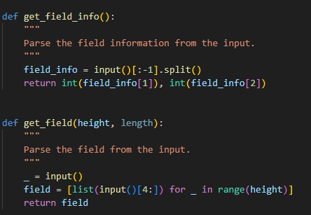
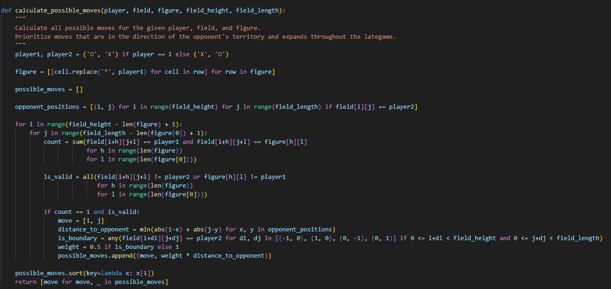

# mini-project-3
Bot for the third project

Визначається, який символ відповідає гравцю і супернику.
Фігура гравця замінюється на символ гравця.
Створюється список можливих ходів.
Визначаються позиції суперника на полі.
Для кожної можливої позиції фігури на полі розраховується кількість перекриттів з символами гравця і перевіряється, чи не перекриває фігура символи суперника.
Якщо фігура може бути розміщена на даній позиції, розраховується відстань до найближчої позиції суперника. Якщо фігура розміщується на межі території суперника, вага відстані зменшується.
Всі можливі ходи сортуються за відстанню до суперника (з урахуванням ваги), і повертається список ходів.
Ця модифікація змусить бота робити ходи більш швидкими і різкими, а після досягнення території суперника бот буде намагатися ізолювати найбільшу частину карти.
Функція повертає хід за вагою.

Починає гру, отримує інформацію про ходи суперника та функція мейн